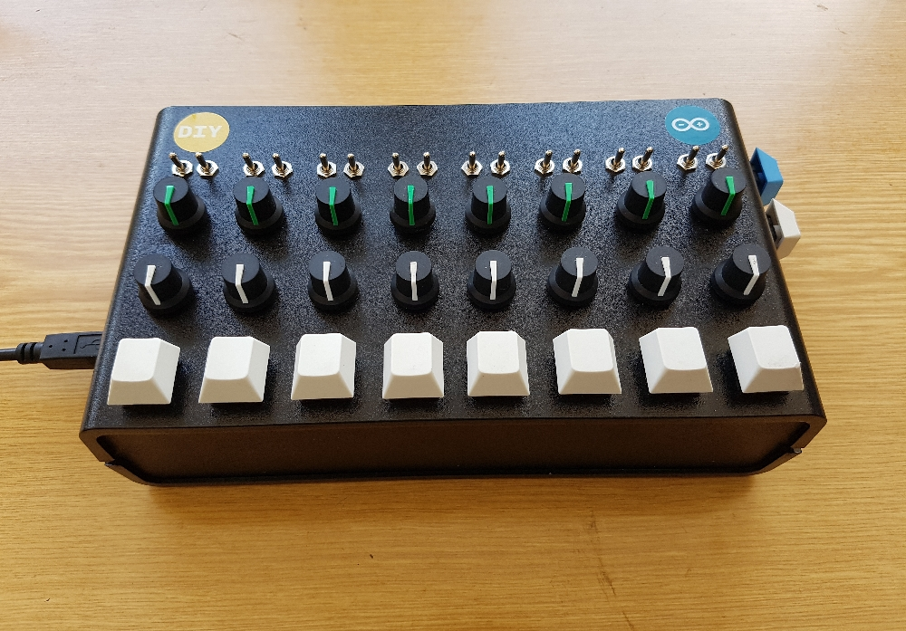
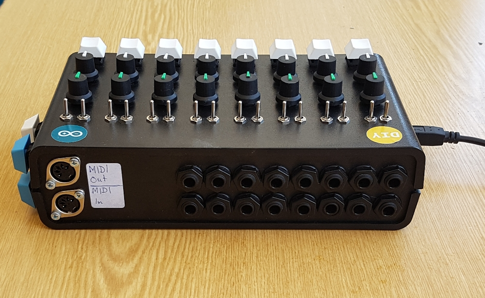
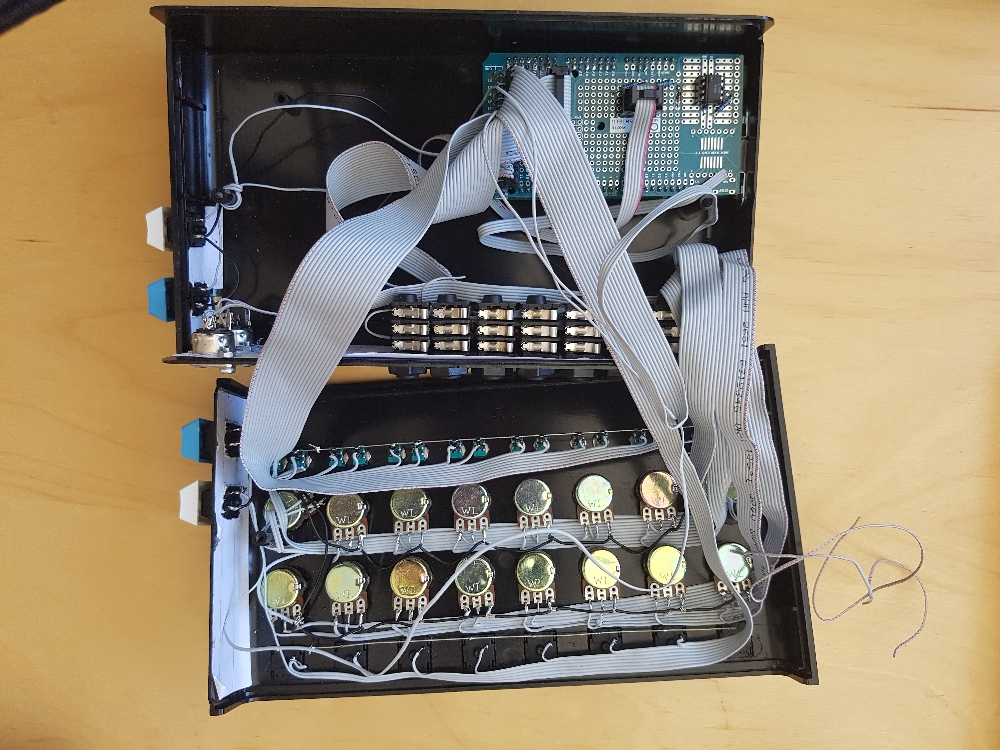
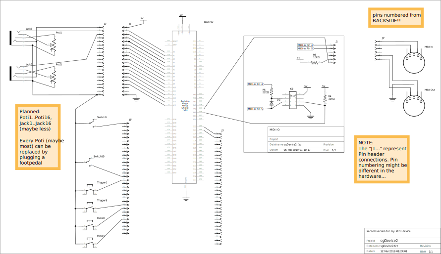

# sgDevice

Software utilities for my homemade midi device to be used with [puredata](https://puredata.info/), the famous computer music software.

## Pictures

## Build Dependencies

- [fish shell](https://fishshell.com/)
- arduino
- arduino-cli

## Runtime Dependencies

- [puredata](https://puredata.info/): sgDevice is a midi controller to be used with puredata.
- [zexy](https://git.iem.at/pd/zexy)
- [structuredData](https://github.com/EsGeh/structuredData): Utiliy library for puredata
- [ttymidi](https://github.com/cjbarnes18/ttymidi): This software can be used to connect the usb input/output to alsa on linux

## Utility Scripts

- init project (download dependencies, ...):

		$ ./scripts/init.fish
	
	This will download and git dependencies into `./dependencies/`

- clean project

		$ ./scripts/exit.fish

## Build and upload Firmware

### sgDevice2

- Turn the Arduino into a native MIDI device:

    The case has to be open in order to set a jumper.
    This (hopefully) has only to be done once!

    plug the device in the PC via USB, then run:

        $ ./scripts/arduino_upload_usb_firmware.fish

    The script will guide you

- Set midi device name:

    plug the device in the PC via USB, then run:

        $ ./scripts/midi_set_device_name.fish

### sgDevice1 (deprecated)

Plug the device in the PC via USB, then run:

    $ ./scripts/arduino_upload.fish

The script will guide you

## Build and install the Puredata Library for sgDevice

### Test locally without installing to system

1. Install library to a local dir

		$ ./scripts/doc_init.fish

2. Run docu

		$ ./scripts/doc_run.fish

	This opens an example patch documenting the major parts of this library.

3. Uninstall library from the local dir

		$ ./scripts/doc_exit.fish

### Installation

- Build and install:

        $ ./scripts/build.fish build install

    (for options append `--help`)

- Install the dependencies: structuredData, zexy

    Please refer to the corresponding documentation for these libraries.

- Add to the pd library search path:

	You have two options:

	- Start pd from the command line like this:

			$ pd -lib sgDevice

	- Add this to `~/.pdsettings` :

			...
			loadlib1: sgDevice
			...

	    (manually adjust the numbering!)

## Documentation

### Puredata Library

The Documentation is provided as puredata example patches.

When the library is installed, inside pd the

    [sgDevice-help]

gives an overview of the relevant objects and how they are used.

Right clicking and selecting "help" opens an example patch for most objects.

### wiring schema

## Testing and Debugging

### Test native Midi Device (experimental)

	$ ./scripts/doc_run.fish --debug

Check `./logs/` directory afterwards

### Via USB (only sgDevice ver 1)

	$ ./scripts/arduino_usbdump.fish

# References

- MIDI Specification:

	- <http://midi.teragonaudio.com/tech/midispec.htm>

- [USBMidiKliK](https://github.com/EsGeh/USBMidiKliK.git):

	Very advanced way to turn the Arduino into a native MIDI Device.
