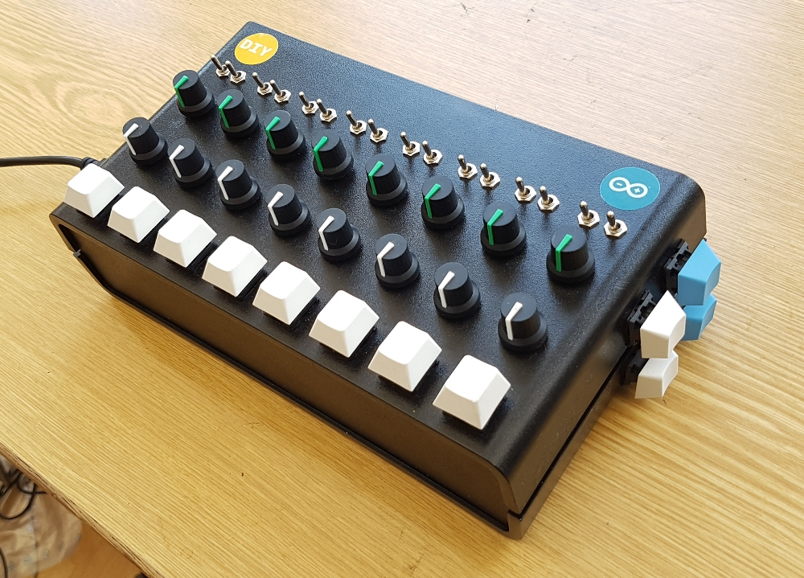

# sgDevice

*sgDevice* is a MIDI interface that can send and receive MIDI messages to/from a computer via USB.
It has a knobs, switches and triggers. The state of these controls is reported to the connected computer.
It may therefore be used as an input device to control *any kind* of software that receives MIDI messages - there is no intrinsic audio related functionality.
sgDevice (ver. 2) uses the [Arduino](https://www.arduino.cc/) Mega microprocessor board.

This repository contains:

- Basic information about *sgDevice*, a homemade MIDI device

- A software library for the [puredata](https://puredata.info/) music software that enables puredata patches to react to messages from the sgDevice. This allows a pd patch to e.g. play notes when a trigger is pressed or updating an effect parameter based on a knob position

- Tools and utility scripts to compile and upload the firmware to the sgDevice

## Pictures

## Demos

[Dark Ambient Music with Puredata+sgDevice2](https://youtube.com/watch?v=bEVVliKHZgQ):

## Prerequisits

- [fish shell](https://fishshell.com/)

## Project setup

- Initialise project (download dependencies, ...):

		$ ./scripts/init.fish
	
	This will download and git dependencies into `./dependencies/`

- Clean project

		$ ./scripts/exit.fish

# Build and upload Firmware

## Build Dependencies

- [arduino-cli](https://github.com/arduino/arduino-cli)
- ( legacy) `arduino`: only for sgDevice1

## sgDevice2

- Turn the Arduino into a native MIDI device:

    The case has to be open in order to set a jumper.
    This (hopefully) has only to be done once!

    plug the device in the PC via USB, then run:

        $ ./scripts/arduino_upload_usb_firmware.fish

    The script will guide you

- Set midi device name:

    plug the device in the PC via USB, then run:

        $ ./scripts/midi_set_device_name.fish

## sgDevice1 (legacy)

Plug the device in the PC via USB, then run:

    $ ./scripts/arduino_upload.fish

The script will guide you

# Build and install the Puredata Library for sgDevice

## Prerequisits

- [puredata](https://puredata.info/): the famous computer music software

## Test locally without installing to system

1. Install library to a local dir

		$ ./scripts/local_init.fish

2. Run Example

		$ ./scripts/local_run.fish

	This opens an example patch documenting the major parts of this library.

3. Uninstall library from the local dir

		$ ./scripts/local_exit.fish

## Installation

- Build and install:

        $ ./scripts/build.fish install

    (for options append `--help`)

- Configure pd to load the library

	start pd and add `structuredDataC` under `File -> Settings -> Start -> New`

- Configure pd to find abstractions

	start pd and add `<install_location>/structuredDataC` under `File -> Settings -> Path -> New`

- Make sure the [dependencies](#dependencies) are installed. Please refer to the corresponding documentation of these libraries.

## Dependencies

- [structuredData](https://github.com/EsGeh/structuredData): Utiliy library for puredata
- [zexy](https://git.iem.at/pd/zexy)

## Documentation

The Documentation is provided as puredata example patches accessible in pd under `Help -> Patch Browser -> structuredDataC`.
Alternatively, for help with a specific object, right click on it and select "help".

# Wiring Schema

# Testing and Debugging

## sgDevice2 - Test native Midi Device

	$ ./scripts/local_init.fish
	$ ./scripts/local_run.fish --debug

Check `./logs/` directory afterwards

## sgDevice1 - Test USB input (legacy)

	$ ./scripts/arduino_usbdump.fish

# References

- MIDI Specification:

	- <http://midi.teragonaudio.com/tech/midispec.htm>

- [USBMidiKliK](https://github.com/EsGeh/USBMidiKliK.git):

	Turn the Arduino into a native MIDI Device.
